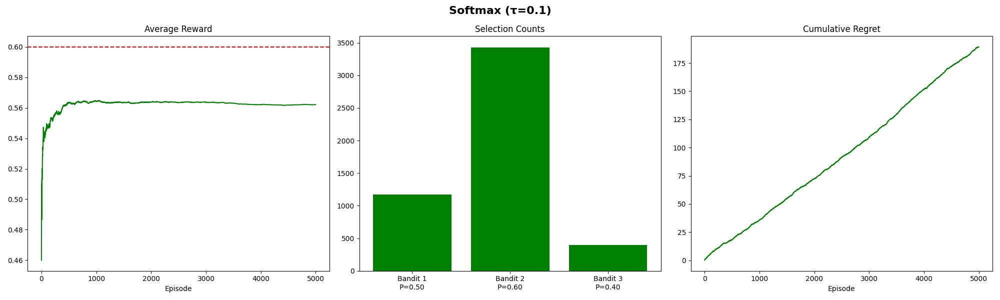

# 🎰 N-Armed Bandit Problem

## Overview

The **n-Armed Bandit Problem** is a classic problem in reinforcement
learning and decision theory. It models a situation where an agent must
choose between multiple competing options (or "arms") that provide
uncertain rewards. The challenge is to balance **exploration** (trying
different options to learn their value) with **exploitation** (choosing
the best-known option to maximize reward).

The name comes from slot machines ("one-armed bandits") — imagine facing
**n** different slot machines, each with an unknown payout distribution.
Which one should you play, and how do you maximize your winnings over
time?

---

## Problem Definition

- There are **n arms** (actions/choices).  
- Each arm has an **unknown reward distribution**.  
- At each step:  
  1. The agent selects one arm.  
  2. A reward is drawn from that arm's probability distribution.  
- The goal is to maximize the **cumulative reward** over time.

---

## Exploration vs. Exploitation

A key difficulty lies in the **trade-off**:  
- **Exploration**: Trying different arms to gain more information.  
- **Exploitation**: Choosing the arm that currently seems best.  

Too much exploration wastes opportunities, while too much exploitation
risks missing better arms.

---

## Common Strategies

### 1. **Greedy Algorithm**

- Always choose the arm with the highest estimated value.  
- Simple but can get stuck in suboptimal arms.

---

### 2. **ε-Greedy Algorithm**

- With probability **ε** (e.g., 0.1), explore randomly.  
- With probability **1 - ε**, exploit the best-known arm.  
- Balances exploration and exploitation.  

Special cases:  
- **ε = 1** → Completely exploratory agent.  
- **ε = 0** → Purely greedy agent.  

---

### 🔍 Comparison Table for ε-Greedy

| Value of ε | Behavior                  | Consequence                                                                 |
|------------|---------------------------|------------------------------------------------------------------------------|
| $ε = 0$    | Pure exploitation         | May get stuck with a suboptimal arm; no new knowledge gained.                |
| $0 < ε < 1$| Mix of exploration & exploitation | Balances learning and maximizing rewards.                           |
| $ε = 1$    | Pure exploration          | Samples uniformly at random; never uses knowledge for better decisions.      |

---

### 3. **Decayed ε-Greedy**

- Starts with a high exploration rate $ε_0$ and gradually decreases
  it over time:  
  `ε_t = ε0 × decay^t`
- Early on, the agent explores heavily.  
- Later, it focuses more on exploitation.  

  

---

### 4. **Softmax (Boltzmann Exploration)**

- Selects arms probabilistically based on their estimated rewards.  
- Uses a **temperature parameter τ**:  
  $$ P(a) = \frac{e^{Q(a)/\tau}}{\sum_j e^{Q(j)/\tau}} $$
- **High τ** → More exploration.  
- **Low τ** → More exploitation.  

  

---

### 5. **Annealed Softmax**

- A variation of Softmax where the temperature $τ$ decreases over time:  
  $$ \tau_t = \tau_0 \times \text{decay}^t $$
- Starts exploratory, then gradually becomes greedy.  

---

### 6. **Upper Confidence Bound (UCB1)**

- Chooses the arm based on both its average reward and the uncertainty:  
  $$ Q(a) + \sqrt{\frac{2 \ln t}{N(a)}} $$
- Encourages trying less-sampled arms while converging to the optimal one.  

---

### 7. **Thompson Sampling**

- A **Bayesian approach**: sample from the posterior distribution of each arm’s reward.  
- Naturally balances exploration and exploitation.  

---

## 📊 Performance Summary

Averaged over **50 runs** and **5000 episodes** with bandits $[0.5, 0.6, 0.4]$.

| Strategy                 | Final Avg Reward | Total Regret |
|---------------------------|------------------|--------------|
| Thompson Sampling         | 0.5939           | 30.7000      |
| Decayed ε                 | 0.5883           | 58.6200      |
| Decayed ε (decay=0.999)   | 0.5882           | 58.8800      |
| Decayed ε (decay=0.99)    | 0.5837           | 81.4400      |
| ε-Greedy (ε=0.1)          | 0.5818           | 91.0000      |
| UCB1                      | 0.5777           | 111.2800     |
| ε-Greedy (0.1)            | 0.5761           | 119.5600     |
| Annealed Softmax          | 0.5611           | 194.5600     |
| Softmax (τ=0.1)           | 0.5597           | 201.3800     |
| ε-Greedy (ε=0.5)          | 0.5489           | 255.7200     |
| Softmax (τ=0.01)          | 0.5139           | 430.3000     |
| Softmax (τ=0.5)           | 0.5125           | 437.2600     |
| Softmax (τ=1)             | 0.5069           | 465.3000     |
| Softmax (τ=2)             | 0.5045           | 477.7000     |
| ε-Greedy (ε=0)            | 0.5011           | 494.5600     |
| ε-Greedy (ε=1)            | 0.4982           | 508.8200     |

**Combined Overview Plot:**  

---

## Applications

The n-Armed Bandit framework is widely applicable in real-world
problems, such as:  
- **Online advertising** (deciding which ad to show).  
- **Recommendation systems** (choosing which content to suggest).  
- **Clinical trials** (selecting treatments to test on patients).  
- **A/B testing** (experimenting with product variations).  

---

## References

- Sutton, R. S., & Barto, A. G. (2018). *Reinforcement Learning: An Introduction*.  
- [Wikipedia: Multi-armed bandit](https://en.wikipedia.org/wiki/Multi-armed_bandit)  
- [Analytics Vidhya: Multi-armed Bandit from Scratch](https://www.analyticsvidhya.com/blog/2018/09/reinforcement-multi-armed-bandit-scratch-python/)  

---
